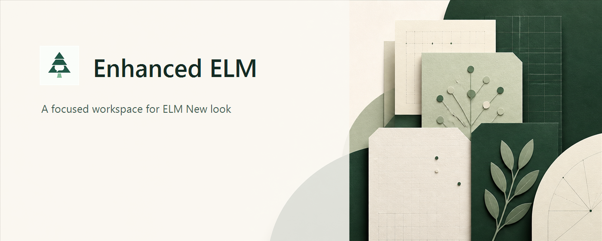
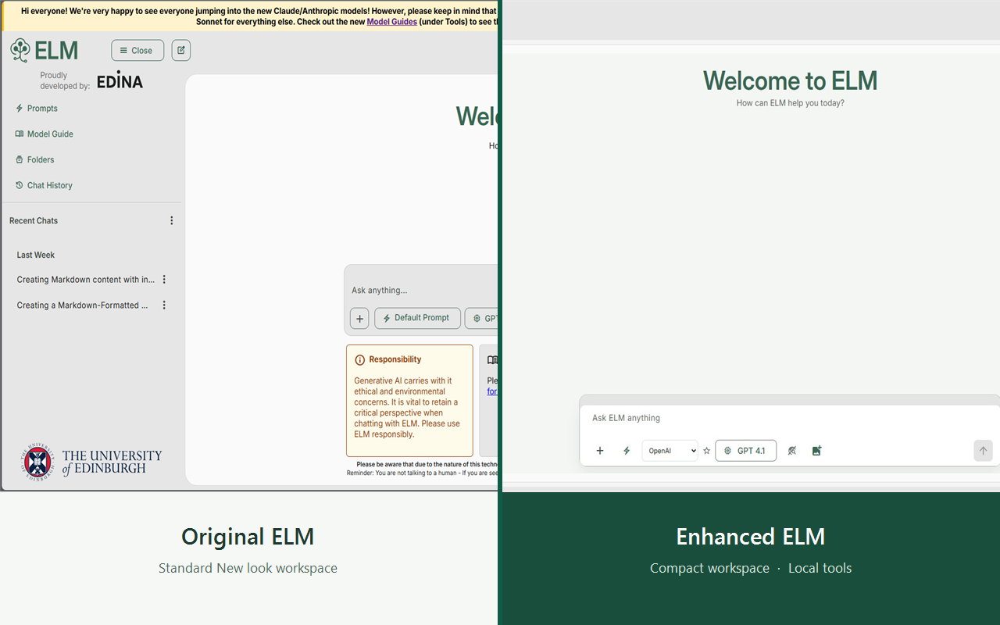

<div align="center">
  <a href="https://github.com/YuyangXueEd/Enhanced-ELM">
    
  </a>
  <h1>Enhanced ELM</h1>
  <p><strong>为 ELM New look 打造的更安静、更好用的工作区。</strong></p>
  <p>本地优先的整理能力、易读的对话界面、保守的数学公式修复，以及实用的 Markdown 工具；不替换 ELM 原有的对话或模型逻辑。</p>
  <p>
    <a href="https://chromewebstore.google.com/detail/enhanced-elm/edofogjhmphlpkmldacibdbibfamnnbp"></a>
    <a href="https://github.com/YuyangXueEd/Enhanced-ELM/releases/latest"></a>
    <a href="LICENSE"></a>
    
    
  </p>
  <p>
    <a href="https://chromewebstore.google.com/detail/enhanced-elm/edofogjhmphlpkmldacibdbibfamnnbp"><strong>前往 Chrome 网上应用店安装</strong></a>
    &nbsp;·&nbsp;
    <a href="https://github.com/YuyangXueEd/Enhanced-ELM/releases/latest">下载最新 Release</a>
    &nbsp;·&nbsp;
    <a href="README.md">English</a>
  </p>
</div>

<p align="center">
  
</p>

<p align="center"><sub>面向 ELM New look 的独立、本地优先增强扩展。</sub></p>

> [!IMPORTANT]
> Enhanced ELM 仅在 [ELM **New look**](https://elm.edina.ac.uk/elm-new) 中生效。本项目是独立项目，与爱丁堡大学、EDINA 或 ELM 没有隶属、背书或运营关系。

## 小扩展，做实事

Enhanced ELM 让 ELM 更适合长期使用，同时始终由 ELM 决定对话、可用模型与回答生成。扩展不包含服务器、分析、远程配置或云同步。

| 工作更专注 | 快速找回内容 | 让回答更好用 |
| --- | --- | --- |
| 紧凑且响应式的明暗工作区、仅标题的对话列表、收起侧栏后的完整阅读宽度，以及固定在新对话底部的输入框。 | 主动保存的本地 Markdown 快照，支持文件夹、标签、搜索和下载；也可以给关键消息加书签、写本地笔记，并用时间线快速定位。 | 单条消息 Markdown 复制、代码块复制、整段对话下载 Markdown、低占用的附件悬浮按钮，以及保守的 KaTeX 数学公式修复。 |

<p align="center">
  
</p>

<p align="center"><sub>同一 ELM New look 工作区：左侧为原始 ELM，右侧为 Enhanced ELM。</sub></p>

## 能力一览

### 更专注的阅读界面

- 为 ELM 原有界面细调的明暗配色、清晰文字与紧凑间距。
- 对话导航只显示标题，不再使用臃肿的会话卡片。
- 收起侧栏时，对话可使用全部可用宽度。
- 新对话和长对话中，输入框都会尽量稳定在靠近底部、便于使用的位置，并兼顾常见笔记本与桌面窗口尺寸。

### 更直观的原生模型控制

- 使用 **模型家族 → ELM 模型** 的工作流：切换家族后会默认选择该家族的第一个模型。
- 实际模型菜单和可用的 reasoning effort 仍完全由 ELM 决定。
- 可将当前模型保存为本地默认偏好，不会修改账号端的任何设置。

### 本地研究资料库

- 仅在你主动操作时保存 Markdown 快照；不会在后台悄悄镜像对话。
- 使用文件夹、标签、全文搜索和本地下载整理已保存内容。
- 给有价值的消息添加书签和本地笔记，并从侧栏直接跳回原位置。

### 更可复用的回答

- 单独复制某条消息为 Markdown，直接复制代码块，或把当前可见对话下载为 Markdown。
- 通过回形针悬浮按钮收纳 ELM 原生附件摘要，只在悬停、聚焦或点击时展开。
- 用内置 KaTeX 修复完整且可恢复的 LaTeX 片段，并可复制修复后的源码。

## 两分钟安装

### Chrome 网上应用店

打开 [Chrome 网上应用店中的 Enhanced ELM](https://chromewebstore.google.com/detail/enhanced-elm/edofogjhmphlpkmldacibdbibfamnnbp)，点击 **添加至 Chrome**，然后打开或刷新 [ELM New look](https://elm.edina.ac.uk/elm-new)。

### 手动 / 测试安装（Chrome 或 Edge）

1. 下载[最新 Release](https://github.com/YuyangXueEd/Enhanced-ELM/releases/latest)并解压，或克隆本仓库。
2. 打开 `chrome://extensions` 或 `edge://extensions`，启用**开发者模式**。
3. 点击 **Load unpacked / 加载已解压的扩展程序**，选择解压后的 Release 目录（其中应包含 `manifest.json`）。
4. 在 ELM 中切换到 **New look**，打开或刷新 `https://elm.edina.ac.uk/elm-new`，再从扩展弹窗中选择是否启用界面、数学修复或 Markdown 工具。

修改源码后，请在扩展卡片上点击 **Reload / 重新加载**，再刷新 ELM。本项目无需构建，仓库目录本身也可以直接作为已解压扩展加载。

如需交给测试者，请使用简短的[测试者快速指南](docs/TESTER-GUIDE.md)。

## 本地优先的设计

- 设置、快照、默认模型偏好、书签与笔记保存在当前浏览器配置文件的 `chrome.storage.local` 中。
- 只有你主动保存快照或为消息创建书签时，对话文字才会持久化；复制和导出操作都在浏览器内完成。
- Enhanced ELM 不会把页面内容、已保存数据或标识符发送给开发者或任何第三方。
- 卸载扩展或清除扩展数据会删除这些本地数据。

上架相关的完整说明见[隐私政策](docs/PRIVACY.md)。

## 保守的数学修复

数学修复只会渲染内置 KaTeX 能够验证的完整公式，支持可恢复的 LaTeX 片段、代码包裹的公式、双重转义命令，以及已观察到的摄氏温度范围拆分问题。它不会穿过普通文本猜测公式、执行远程代码或替换任意页面内容；无法安全解析时会保留原文。

KaTeX 0.17.0 已随扩展打包，许可证见 [THIRD_PARTY_NOTICES.md](THIRD_PARTY_NOTICES.md)。如果同时安装了 [ELM Math Fixer](https://github.com/lambdacdm/ELM-Math-Fixer)，比较修复结果时请一次只启用一个数学修复扩展，以免同时处理同一段可见文本。

## 尊重 ELM 的排版

Enhanced ELM 保留 ELM 原有的界面与正文字体，仅为代码等明确的等宽内容在本地提供 CaskaydiaCove Nerd Font。扩展不会向 Google Fonts 或其他第三方字体服务发起请求；数学公式和 Material 图标继续使用各自专用字体。

## 开发与贡献

```text
manifest.json                 Manifest V3 入口
src/core/                     功能注册、DOM 工具与本地工作区存储
src/features/                 独立的模型、数学、Markdown、资料库、书签、时间线与侧栏模块
src/vendor/katex/             打包在本地的 KaTeX 运行时与字体
src/content.js                轻量生命周期与编排脚本
src/content.css               Clean workspace 基础样式
src/features.css              功能局部样式
```

修改 JavaScript 源码后，可运行快速语法检查：

```powershell
Get-ChildItem -Recurse -File src -Filter *.js |
  Where-Object { $_.FullName -notmatch '\\vendor\\' } |
  ForEach-Object { node --check $_.FullName }
```

[架构说明](docs/architecture.md)介绍数据边界，[TESTING.md](docs/TESTING.md)记录手动回归测试。欢迎提交 Issue 和 Pull Request；请先阅读 [CONTRIBUTING.md](CONTRIBUTING.md)，并保持改动仅面向 ELM、本地优先且可独立测试。

### 自动发布 GitHub Release

推送匹配的标签（例如 `v0.1.2`）后，工作流会自动打包扩展并发布 GitHub Release。标签、`manifest.json` 与 `CHANGELOG.md` 版本不一致时会拒绝发布；Chrome Web Store 和 Edge Add-ons 的上架仍需手动完成。完整步骤见 [RELEASING.md](docs/RELEASING.md)。

## 许可证

Enhanced ELM 使用 [MIT License](LICENSE) 发布。KaTeX 及其字体保留各自的 MIT 声明，详见 [THIRD_PARTY_NOTICES.md](THIRD_PARTY_NOTICES.md)。
